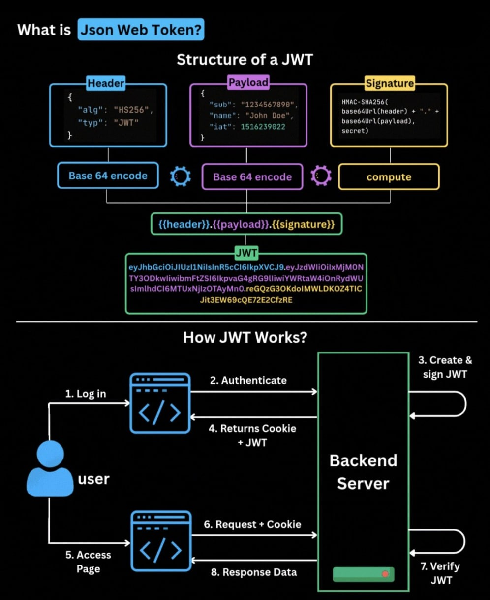

# JWT Authentication in ASP.NET Core

## Overview

JSON Web Token (JWT) is an open standard (RFC 7519) for securely transmitting information between parties as a JSON object. In ASP.NET Core, JWT authentication is used to protect APIs and web applications by validating tokens included in HTTP requests.

### Key Concepts

* Stateless: No server-side session storage required

* Self-contained: Token contains all necessary user information

* Digitally signed: Prevents tampering and ensures authenticity

## Jwt Structure
A JWT consists of three parts separated by dots:

``` header.payload.signature ```



## Setup and Configuration

Configuring a user authentication system using JWT in an ASP.NET Core application. Where users can register and log in, receiving a JWT token upon successful authentication.

### 1. Install Required Packages

```
Microsoft.AspNetCore.Authentication.JwtBearer
System.IdentityModel.Tokens.Jwt
```

### 2. Configuration in appsettings.json

```json
{
  "Jwt": {
    "SecretKey": "your-super-secret-key-minimum-16-characters",
    "Issuer": "your-app-name", //authentication server (example: "https://sso.example.com")
    "Audience": "your-app-users", // Specific application (example: "https://api.example.com/users")
    "ExpiryInMinutes": 60
  }
}
```

### 3. Configure JWT Authentication in Program.cs

```csharp
using Microsoft.AspNetCore.Authentication.JwtBearer;
using Microsoft.IdentityModel.Tokens;
using System.Text;

var builder = WebApplication.CreateBuilder(args);

// Add JWT authentication.
builder.Services.AddAuthentication(options =>
{
    options.DefaultAuthenticateScheme = JwtBearerDefaults.AuthenticationScheme;
    options.DefaultChallengeScheme = JwtBearerDefaults.AuthenticationScheme;
})
.AddJwtBearer(options =>
{
    var jwtSettings = builder.Configuration.GetSection("Jwt");
    var secretKey = jwtSettings["SecretKey"];
    var issuer = jwtSettings["Issuer"];
    var audience = jwtSettings["Audience"];

    options.TokenValidationParameters = new TokenValidationParameters
    {
        ValidateIssuer = true,
        ValidateAudience = true,
        ValidateLifetime = true,
        ValidateIssuerSigningKey = true,
        ValidIssuer = issuer,
        ValidAudience = audience,
        IssuerSigningKey = new SymmetricSecurityKey(Encoding.UTF8.GetBytes(secretKey))
    };
});

// Add authorization services
builder.Services.AddAuthorization();


//Configure rest of the services and components

var app = builder.Build();

// add UseAuthentication first
app.UseAuthentication();
app.UseAuthorization();

// Other middleware and endpoints

app.Run();
```

## Implementation Steps

### 1. Creating DTOs for register and login

#### RegisterDto.cs
```csharp
public class RegisterDto
{
    public string Username { get; set; }
    public string Password { get; set; }
    public string Email { get; set; }
}
```
#### LoginDto.cs
```csharp
public class LoginDto
{
    public string Email { get; set; }
    public string Password { get; set; }
}
```

#### LoginResponseDto.cs
```csharp
public class LoginResponseDto
{
    public string Token { get; set; }
    public DateTime Expiration { get; set; }
}
```

### 2. Create a simple User Model
#### User.cs
```csharp
public class User
{
    public int Id { get; set; }
    public string Username { get; set; }
    public string Email { get; set; }
    public byte[] PasswordHash { get; set; }
    public byte[] PasswordSalt { get; set; }
}
```

### 3. AuthService

#### Services/IAuthService.cs
```csharp
public interface IAuthService
{
    Task<string> RegisterAsync(RegisterDto registerDto);
    Task<LoginResponseDto> LoginAsync(LoginDto loginDto);
}
```

#### Services/AuthService.cs
```csharp

public class AuthService : IAuthService
{
    private readonly IConfiguration _configuration;
    private readonly AppDbContext _context; // Assuming you have a DbContext for your database

    public AuthService(IConfiguration configuration, AppDbContext context)
    {
        _configuration = configuration;
        _context = context;
    }
    public async Task<string> RegisterAsync(RegisterDto registerDto)
    {
        var userExists = await _context.Users.AnyAsync(u => u.Email == registerDto.Email);
        if (userExists)
            throw new Exception("User already exists");

        // create user
        var user = new User
        {
            Username = registerDto.Username,
            Email = registerDto.Email
        };

        // Create password hash
        using (var hmac = new HMACSHA512())
        {
            user.PasswordHash = hmac.ComputeHash(Encoding.UTF8.GetBytes(registerDto.Password));
            user.PasswordSalt = hmac.Key;
        }

        _context.Users.Add(user);
        await _context.SaveChangesAsync();

        return user;
    }

    public async Task<LoginResponseDto> LoginAsync(LoginDto loginDto)
    {
        var user = await _context.Users.SingleOrDefaultAsync(u => u.Email == loginDto.Email);
        if (user == null)
            throw new Exception("User not found");

        // Verify password
        using (var hmac = new HMACSHA512(user.PasswordSalt))
        {
            var computedHash = hmac.ComputeHash(Encoding.UTF8.GetBytes(loginDto.Password));
            for (int i = 0; i < computedHash.Length; i++)
            {
                if (computedHash[i] != user.PasswordHash[i])
                    throw new Exception("Incorrect password");
            }
        }
        // How Verify Password works:
        // 1. It takes the plain text password, stored hash, and stored salt as inputs.
        // 2. It creates a new HMACSHA512 instance using the stored salt.
        // 3. It computes the hash of the provided password using the same salt.
        // 4. It compares the computed hash with the stored hash.


        // Create claims
        var claims = new List<Claim>
        {
            new Claim(ClaimTypes.NameIdentifier, user.Id.ToString()),
            new Claim(ClaimTypes.Name, user.Username),
            new Claim(ClaimTypes.Email, user.Email)
        };

        // Generate JWT token

        // get secret key from configuration
        var key = Encoding.UTF8.GetBytes(_configuration["Jwt:SecretKey"]);

        // Create signing credentials
        var creds = new SigningCredentials(new SymmetricSecurityKey(key), SecurityAlgorithms.HmacSha512Signature); // Use HMAC SHA512 for better security

        // Create token descriptor
        var tokenDescriptor = new SecurityTokenDescriptor
        {
            Subject = new ClaimsIdentity(claims),
            Expires = DateTime.UtcNow.AddDays(7), // Token expiration

            // if valid issuer and audience are set in configuration, use them
            Issuer = _configuration["Jwt:Issuer"],
            Audience = _configuration["Jwt:Audience"],

            
            SigningCredentials = creds
        };
        // Create token handler -> meaning: to create the token (responsible for creating and writing tokens)
        var tokenHandler = new JwtSecurityTokenHandler();
        
        // Create the token
        var token = tokenHandler.CreateToken(tokenDescriptor);

        // Return the token and expiration
        return new LoginResponseDto
        {
            Token = tokenHandler.WriteToken(token),
            Expiration = tokenDescriptor.Expires.Value
        };
    }
}
```

4. Register AuthService in Program.cs

```csharp
builder.Services.AddScoped<IAuthService, AuthService>();
```
### 5. Create AuthController
```csharp
using Microsoft.AspNetCore.Mvc;

[ApiController]
[Route("api/[controller]")]
public class AuthController : ControllerBase
{
    private readonly IAuthService _authService;

    public AuthController(IAuthService authService)
    {
        _authService = authService;
    }

    [HttpPost("register")]
    public async Task<IActionResult> Register([FromBody] RegisterDto registerDto)
    {
        try
        {
            var result = await _authService.RegisterAsync(registerDto);
            return Ok(result);
        }
        catch (Exception ex)
        {
            return BadRequest(new { message = ex.Message });
        }
    }

    [HttpPost("login")]
    public async Task<IActionResult> Login([FromBody] LoginDto loginDto)
    {
        try
        {
            var result = await _authService.LoginAsync(loginDto);
            if (result == null)
                return Unauthorized(new { message = "Invalid credentials" });
            return Ok(result);
        }
        catch (Exception ex)
        {
            return BadRequest(new { message = ex.Message });
        }
    }
}
```

Now run your application. You can test the registration and login endpoints using tools like Postman or swagger. Upon successful login, you will receive a JWT token that can be used to access protected resources by including it in the Authorization header of your HTTP requests.